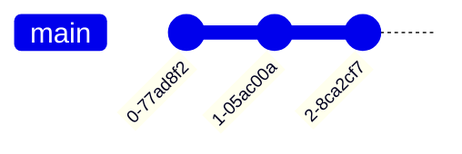

Overview of Git
---

# What is Git? 

Git is a version control system (VCS). 

 - Created by Linus Torvalds in 2005
 - Used by > 100 million developers
 - Enables collaboration and management of codebases

<!--pause-->

# Why use Git? 

 - Version Control: Keep track of changes, revert to previous versions, and manage multiple versions of your project.
 - Collaboration: Multiple developers can work on the same project simultaneously.
 - Branching and Merging: Experiment with new features or fixes in isolated branches, then merge them back into the main project.
 - Backup: Your entire project history is saved in Git, reducing the risk of data loss.

<!-- end_slide -->

Commits
---

A commit is a set of removals and additions of lines of code. 

```diff
public class Hello1
{
   public static void Main()
   {
-      System.Console.WriteLine("Hello, World!");
+      System.Console.WriteLine("Greetings, friends!");
   }
}
```

<!--pause-->

Commits are uniquely identified by a hash and are annotated with 'commit messages', which describe the changes in a human-friendly way. 

```
commit 9dd554d9436b25f2fcc3a182c2f94b5dcaae06fa
Author: Eirik Kultorp <retracted-email@example.com>
Date:   Fri Aug 16 09:00:42 2024 +0200

    enable compiler optimizations
```

<!--pause-->

Commits are organized as linked lists. The state of a codebase at any time can be reconstructed by applying each previous commit in sequence. 



<!-- end_slide -->
Git Branches
---

Commit chains can have **branches**. 


<!-- pause -->

Typical use cases: 
 - develop a new feature or bug fix without affecting other developmers
 - create a new release

<!-- end_slide -->
Merging branches
---

Branches can me **merged**. 


<!-- pause -->

Typical use cases: 
 - include a new feature into the main branch
 - include a hotfix to a release branch

<!-- pause -->

# Merge conflicts

What if commits C and D conflict? 

## C 

```diff
-      System.Console.WriteLine("Hello, World!");
+      System.Console.WriteLine("Greetings, friends!");
```

## D 

```diff
-      System.Console.WriteLine("Hello, World!");
+      System.Console.WriteLine("Hey, gang!");
```

<!-- pause -->

Need to either accept their changes, your own changes, or manually combine the changes in a merge commit. 

<!-- end_slide -->

Git workflow
---


 - Working Directory: Where you actively edit files.
 - Staging Area: A place to prepare your changes before committing.
 - Local Repository: Your own copy of the project, including its history.
 - Remote Repository: A version of your repository hosted on a server (e.g., GitHub, GitLab).

<!-- pause -->

# Some git commands

 - git add [file]: Add file(s) to the staging area.
 - git commit -m "[message]": Commit the staged changes with a message.
<!-- pause -->
 - git clone [url]: Clone an existing repository.
 - git pull: Fetch and merge changes from the remote repository.
 - git push: Push your local changes to the remote repository.
<!-- pause -->
 - git status: Check the status of your files in the working directory and staging area.
 - git log: View the commit history.
 - git checkout [branch-name]: Switch to another branch.
 - git branch: List branches or create a new branch.

<!-- end_slide -->

Github
---

Github is one of several platforms for hosting Git repositories. Github has no ownership over Git - Git is open source and free, Github is a proprietary product owned by Microsoft. 

Github provides many features which work well in combination with the Git workflow. 

 - Collaberation and access control for repositories - invite your fellow coders to work in the same repository. 
 - Pipelines ("Actions") which can be configured to run automatically on every commit. Can be used for automatic testing, building, and deployment of your software. 
 - Issues: a place for users and developers to report bugs or suggest changes to the software. 
 - Pull requests: a request to merge a branch into another, along with text discussion. Useful for peer reviews. 
 - Tagging of commits, pull requests, users, repositories in commit messages and discussions/documents. 

<!-- end_slide -->

Advanced topics
---

Some more advanced topics, which we don't cover here: 

 - Rebasing: A technique to rearrange a series of commits, rewriting history. 
 - Cherry-Picking: Apply specific commits from one branch to another.
 - Submodules: Include other Git repositories within a repository.
 - Hooks: Scripts that run automatically at certain points in Git operations.

<!-- end_slide -->
Best Practices
---

 - Commit Often: Small, frequent commits make it easier to track changes.
 - Write Meaningful Commit Messages: Helps in understanding the project history.
 - Use Branches: Keep your main branch stable; use branches for development.
 - Review Code: Use pull requests and code reviews to maintain code quality.
